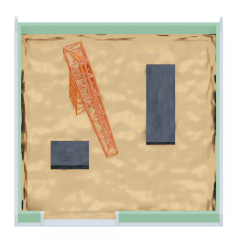
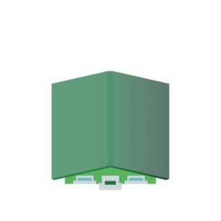
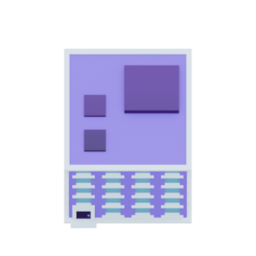
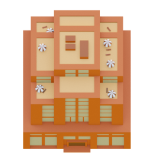
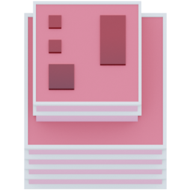
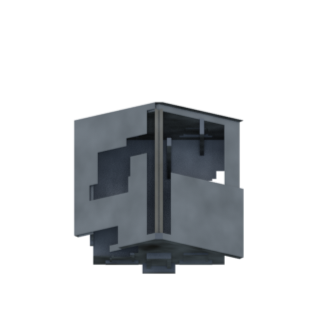
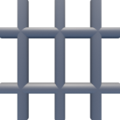
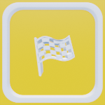

# Monopoly (VR1b)


Jeu inspiré du Monopoly

- Agrane Benlalam Adam Christophe
- Cisse   Sekou
- Fernez  Dimitri
- Peris   Jules
- Maissouradze    Nicolas

## Lancement du jeu
Il faut java 21 et lancer la commande suivante : 
```
./gradlew run
```

## Rapport
`Rapport_vr1b.pdf`

## Structure du projet
Les fichiers sources sont dans `src/main/java/monopoly/`

Les ressources sont dans `src/main/resources/`

## Règles du jeu
Le jeu se joue de 2 à 5 joueurs, chacun possède un pion et commence avec 1000€ le but du jeu est d'être le dernier joueur en jeu.
le joueur lance un dé à 6 faces et avance du nombre de cases correspondant au résultat du dé, il peut acheter ou amélorer la case adjacente sur laquelle il est tombé.
Si un joueur tombe sur une case appartenant à un autre joueur, il doit payer un loyer à ce joueur.
Si un joueur n'a plus d'argent et qu'il ne peut plus vendre , il est éliminé du jeu.

## Eléments de jeu
 - Les Batiments qui correspond a la couleur du joueur, le niveau du batiment et la direction du batiment

 
 
 
 
 
 


- Les cartes


- Les cases bonus






- Les joueurs


